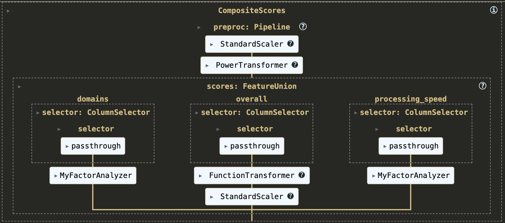

# Creyos Composite Score Calculators

## Description

This repsitory is a Datalad dataset that can also be installed as a Python package. Its purpose is to provide a SciKit-Learn -style API for calculating composite cognitives scores from individual test scores on the Creyos cognitive battery - as described in [Wild et al. 2022](https://www.cell.com/cell-reports-medicine/fulltext/S2666-3791(22)00299-3) (see also the [GitHub](https://github.com/TheOwenLab/2021-Wild-et-al-COVID-Cognition) and [OSF](https://osf.io/c6d2u/) repositories for that project). There are five composite scores, and as described in Wild et al.:

> ... we compared the COVID+ cohort to normative data on 5 composite scores (i.e., domains) of cognitive performance, instead instead of testing each of the 12 cognitive tasks separately. Three of these measures were derived from a principal-components analysis of the 12 cognitive test scores. Replicating our previous work,40 these three components could generally be described as representing cognitive performance in three separate domains: visuospatial short-term memory (STM), reasoning, and verbal domains (Figure 1A). Similar factor solutions were produced from the cognitive test scores in the normative and COVID+ samples (see Figure S2 and Table S3). The remaining two composite scores were overall performance across the cognitive task battery and average processing speed (i.e., a reaction-time based measure across all tests).

In other words, the 12 individual tasks in the Creyos battery can be reduced to a set of 5 composite scores that reflect cognitive performance in more broadly defined cognitive domains. This is helpful as it reduces the number of statistical comparisons (fewer dependent variables to examine), and can ease the interpretations of results.

## Methods

The composite scores are calcualted as described in Wild et al. 2022. Importantly, note that all parameters are derived from the normative sample; scores are then calculated in the patient group. Therefore, it is possible to apply these parameters and calculations to other study samples, and their scores will reflect performance relative to the normative sample as well.

> To factorize the 12 cognitive test scores, we performed a PCA with three components and a Varimax rotation as we have done previously. The solution (Figure 1A) was consistent with our previous findings,44 and these components were interpreted as broadly representing short-term memory (STM), reasoning, and verbal ability. Composite scores representing performance in these domains were calculated by transforming participants’ 12 test scores using the PCA loadings.43,44 We also calculated an ‘‘overall’’ score of cognitive performance (the mean of the 12 z-scored primary outcomes) and a measure of ‘‘processing speed’’ (the 1st principal component of the 11 reaction-time based features). Composite scores were positively correlated with higher individual test scores and faster responses, and a supplementary analysis showed similar factor solutions were derived from both groups. Prior to the PCA analysis and score calculations, cognitive test data for both groups were standardized (M = 0.0, SD= 1.0) using the means and standard deviations from the normative sample. A power transformation47 was applied (again, using parameters esti- mated from the normative data) to reduce skewness and improve normality of the test score features. The models, parameters, and transformations for these composite score calculations were derived using norms, and therefore: 1) had M = 0.0 and SD = 1.0 in the normative group, and 2) for COVID + participants represented performance relative to norms in units of standard deviations.

These steps were implemented as A SciKit-Learn pipeline and trained on the normative data from Wild et al. 2022. These data are stored as a Datalad subdataset within this repository (`composite_scores/data/covidcog`) and will be cloned from OSF (https://osf.io/c6d2u/) if required.



# Installation

### For General Use

This repository can be installed directly from GitHub into your Python environment, granting you easy access to the pre-trained pipeline. With this method, none of the training data are available because they are stored in a Datalad subdataset.

`pip3 install --no-cache https://github.com/conorwild/creyos-score-calculator.git`

### For Developers

Alternatively, you can use Datalad to clone this repository (and the subdataset) from OSF:
```
datalad clone https://osf.io/vqeph composite_scores
cd composite_scores

# Recursively fetch the subdatasets
datalad get -r .

# Then, install into your Python environment (conda, venv, etc.)
pip3 install -e\[dev]
```

# Usage
```
from composite_scores import CompositeScores
score_calculator = CompositeScores.load_pretrained()
new_score_df = score_calculator.transform(original_data_df[score_calculator.feature_names_in_])
```
- Notice that you have to select only the columns from your original data that used by the score calculator pipeline.

# Developer Notes
- Don't forget to do a `datalad get composite_scores/data/covidcog` to pull the data and code for that sub-package.
- Two directories, `images/` and `composite_scores/models`, use `.gitattributes` to override the annexing behaviour so that **no** files in these directories are put in the annex. This makes it possible for this package to be installed directly via pip.
